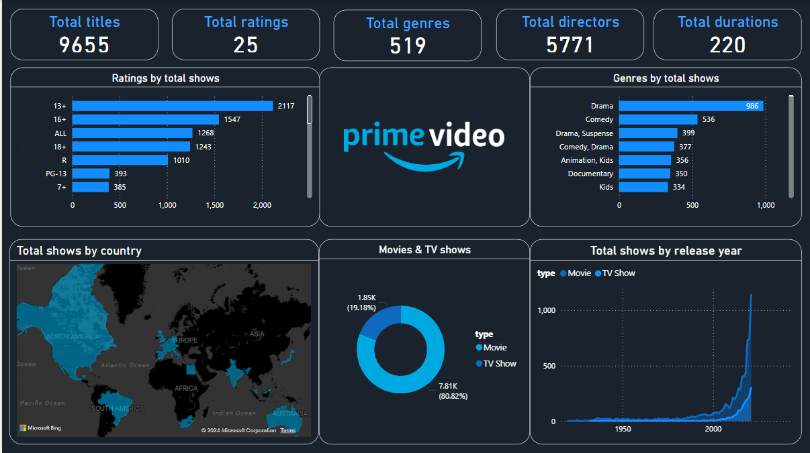

# Data Science Practices Repository

Welcome to my data science practices repository! This repository explores various data science practices based on Data Visualization & Analytics like Exploratory Data Analysis, statistical analysis, machine learning, and data visualization with Power BI. 

## Overview

This repository contains Jupyter Notebook files covering a range of data science practices. Here's a brief overview of what you can find:

1. Exploratory Data Analysis on a given dataset using Python.
2. Calculation of mean, median, and mode of the first 50 records in the dataset using Python.
3. Multiple Linear Regression on data.
4. Logistic Regression on a dataset.
6. K-means clustering to gain insights from data.
7. Decision tree classification algorithm using a dataset.
9. Plotting various graphs for Data Visualization on Power BI.
10. Amazon Prime Videos Dashbbaord on Power BI.

    

 

## Contents

Each practical is implemented as a Jupyter Notebook, providing detailed explanations and code examples for each practice.

## Suggestions for Contribution

- Feel free to suggest improvements or new practices to be added to this repository.
- If you find any bugs or issues, please report them in the "Issues" section.
- Contributions through pull requests are welcome!

Happy coding!!
